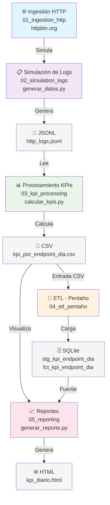
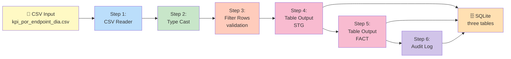
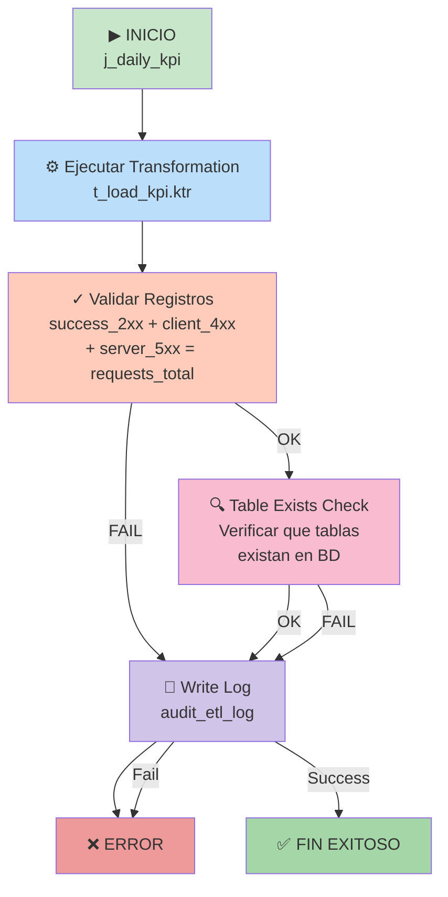

# Diagrama del Pipeline ETL - Cliente HTTP Automatizado

## Flujo completo del pipeline:



## Detalle del flujo ETL (Módulo 04):



## Estructura de datos - Tablas SQLite:

```
STG_KPI_ENDPOINT_DIA (Staging)
├─ date_utc (TEXT) ────────────┐
├─ endpoint_base (TEXT) ───────┤─ PRIMARY KEY
├─ requests_total (INTEGER)    │
├─ success_2xx (INTEGER)       │
├─ client_4xx (INTEGER)        │
├─ server_5xx (INTEGER)        │
├─ parse_errors (INTEGER)      │
├─ avg_elapsed_ms (REAL)       │
├─ p90_elapsed_ms (REAL)       │
└─ created_at (TIMESTAMP)      └─ Auditoría

FCT_KPI_ENDPOINT_DIA (Fact Table)
└─ [IDÉNTICA A STG]
   (Copia para análisis independiente)

AUDIT_ETL_LOG (Auditoría)
├─ id (INTEGER) ───────────────────┐
├─ job_name (TEXT)                │─ PRIMARY KEY
├─ execution_date (TIMESTAMP)      │
├─ records_loaded (INTEGER)        │
├─ records_expected (INTEGER)      │
├─ status (TEXT)                   │
├─ error_message (TEXT)            │
└─ duration_seconds (REAL)         └─ Auditoría
```

## Job Pentaho (j_daily_kpi.kjb):



## Pipeline completo - Vista macro:

```
┌─────────────────────────────────────────────────────────────────┐
│                    CLIENTE HTTP AUTOMATIZADO                     │
└─────────────────────────────────────────────────────────────────┘

┌──────────────────┐   ┌──────────────────┐   ┌──────────────────┐
│  01 - Ingestión  │   │  02 - Simulación │   │  03 - Cálculo    │
│      HTTP        │──→│      de Logs     │──→│      de KPIs      │
│ httpbin.org      │   │ generar_datos.py │   │ calcular_kpis.py │
└──────────────────┘   └──────────────────┘   └──────────────────┘
                                                       │
                          ┌────────────────────────────┼────────────────────────────┐
                          │                            │                            │
                          ▼                            ▼                            ▼
                   ┌──────────────────┐       ┌──────────────────┐       ┌──────────────────┐
                   │  04 - ETL        │       │  05 - Reportes   │       │  Análisis Local  │
                   │    Pentaho       │       │     HTML         │       │     CSV / XML    │
                   └──────────────────┘       └──────────────────┘       └──────────────────┘
                          │
                          ▼
                   ┌──────────────────┐
                   │    SQLite DB     │
                   │  - stg_*         │
                   │  - fct_*         │
                   │  - audit_*       │
                   └──────────────────┘
```

## Componentes del Job ETL:

1. **CSV Input**: Lee `kpi_por_endpoint_dia.csv`
2. **Type Casting**: Convierte strings a tipos correctos (fecha, int, float)
3. **Filter Rows**: Valida que parse_errors + 2xx + 4xx + 5xx = requests_total
4. **Table Output (STG)**: Inserta en stg_kpi_endpoint_dia
5. **Table Output (FCT)**: Inserta en fct_kpi_endpoint_dia
6. **Audit Logger**: Registra resultado en audit_etl_log

## Validaciones del Job:

- ✓ Archivo CSV existe
- ✓ Columnas requeridas presentes
- ✓ Tipos de datos correctos
- ✓ Sanidad de datos (sumas coinciden)
- ✓ Registros cargados = registros esperados
- ✓ Timestamps válidos

## Ejecución del Job:

```bash
# Desde Pentaho Spoon (GUI)
File → Open → j_daily_kpi.kjb → Run

# O desde la línea de comandos
./pdi/sh/kitchen.sh -file=/path/to/j_daily_kpi.kjb
```
