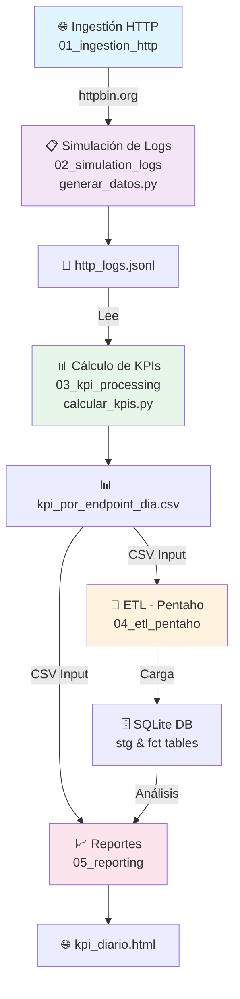

# Pipeline de Ingestión HTTP, Procesamiento de KPIs y ETL

## 📋 Tabla de contenidos

1. [Descripción general](#descripción-general)
2. [Requisitos del proyecto](#requisitos-del-proyecto)
3. [Instalación y configuración](#instalación-y-configuración)
4. [Estructura del proyecto](#estructura-del-proyecto)
5. [Cómo ejecutar el pipeline](#cómo-ejecutar-el-pipeline)
6. [Módulos principales](#módulos-principales)
7. [Flujo de datos completo](#flujo-de-datos-completo)
8. [Troubleshooting](#troubleshooting)
9. [Tecnologías utilizadas](#tecnologías-utilizadas)

---

## 📖 Descripción general

Este proyecto implementa un **pipeline de datos end-to-end** que:

1. **Simula ingestión HTTP** desde APIs (httpbin.org)
2. **Genera logs sintéticos** con patrones realistas de tráfico
3. **Procesa datos** y calcula KPIs diarios por endpoint
4. **Carga datos** en base de datos usando ETL (Pentaho)
5. **Genera reportes** HTML con visualizaciones

### 🎯 Objetivos

- Consumir endpoints HTTP con autenticación, cookies, redirecciones, etc.
---

## 📋 Requisitos del proyecto

### Requisitos de negocio

**Tareas de Ingestión HTTP:**
- ✅ Autenticación básica (usuario_test / clave123)
- ✅ Manejo de cookies y sesiones
- ✅ Simulación de restricciones (403)
- ✅ Extracción de datos en JSON, XML, HTML
- ✅ Simulación de envío de formularios
- ✅ Manejo de redirecciones

**Procesamiento de datos:**
- ✅ Generación de 500+ logs sintéticos
- ✅ Cálculo de KPIs diarios (requests, éxitos, errores, latencia, percentiles)
- ✅ Normalización de endpoints

**Reportes:**
- ✅ HTML con tablas y gráficos
- ✅ Métricas globales por endpoint
- ✅ Alertas de rendimiento

### Requisitos técnicos

| Requerimiento | Versión |
|--------------|---------|
| Python | 3.8+ |
| requests | 2.31.0+ |
| faker | 20.0.0+ |
| beautifulsoup4 | 4.12.0+ |
| lxml | 4.9.0+ |
| pandas | 2.0.0+ |
| numpy | 1.24.0+ |
| matplotlib | 3.7.0+ |

**Opcional (para ETL):**
- Pentaho Data Integration 9.0+
- SQLite 3.0+

---

## ⚙️ Instalación y configuración

### 1. Clonar o descargar el proyecto

```bash
# Si usas git
git clone <URL_DEL_REPO>
cd client-automated-HTTP

# Si descargaste un ZIP, descomprimelo y abre la carpeta
cd client-automated-HTTP
```

### 2. Crear un ambiente virtual (recomendado)

```bash
# Windows
python -m venv venv
venv\Scripts\activate

# Linux / macOS
python3 -m venv venv
source venv/bin/activate
```

### 3. Instalar dependencias

```bash
pip install --upgrade pip
pip install -r requirements.txt
```

### 4. Validar instalación

```bash
python setup_and_validate.py
```

**Salida esperada:**
```
✓ Python version >= 3.8
✓ All required packages installed
✓ Directory structure OK
✓ Main files present
✓ requirements.txt found

✓ El proyecto está listo para ejecutar.
```

### 5. (Opcional) Configurar Pentaho

Si deseas usar el módulo de ETL con Pentaho:

1. Descarga Pentaho Data Integration (PDI) desde [pentaho.com](https://www.pentaho.com)
2. Extrae en `04_etl_pentaho/`
3. Los archivos `.ktr` y `.kjb` ya están en el proyecto

---

## 📁 Estructura del proyecto

```
client-automated-HTTP/
│
├── 01_ingestion_http/              # Módulo 1: Ingestión HTTP
│   ├── run_all.py                  # Script principal
│   ├── auth/                       # Autenticación básica
│   ├── cookies/                    # Cookies y sesiones
│   ├── extraction/                 # JSON, XML, HTML
│   ├── forms/                      # Formularios POST
│   ├── errors/                     # Manejo de 403
│   ├── redirects/                  # Redirecciones
│   └── out/                        # Salidas
│
├── 02_simulation_logs/             # Módulo 2: Logs sintéticos
│   ├── generar_datos.py            # Generador JSONL
│   └── out/                        # Logs generados
│
├── 03_kpi_processing/              # Módulo 3: KPIs
│   ├── calcular_kpis.py            # Calculador de KPIs
│   ├── README.md                   # Documentación
│   └── out/                        # KPIs (CSV)
│
├── 04_etl_pentaho/                 # Módulo 4: ETL
│   ├── t_load_kpi.ktr              # Transformación
│   ├── j_daily_kpi.kjb             # Job
│   ├── db/                         # Base de datos
│   └── logs/                       # Logs
│
├── 05_reporting/                   # Módulo 5: Reportes
│   ├── generar_reporte.py          # Generador HTML
│   └── out/                        # Reportes
│
├── setup_and_validate.py           # Validación del ambiente
├── requirements.txt                # Dependencias
└── README.md                       # Este archivo
```

---

## 🚀 Cómo ejecutar el pipeline

### Ejecución completa (paso a paso)

```bash
# 1. Validar que todo está instalado
python setup_and_validate.py

# 2. Generar datos simulados
python 02_simulation_logs/generar_datos.py \
  --n_registros 500 \
  --seed 42

# 3. Calcular KPIs
python 03_kpi_processing/calcular_kpis.py \
  --input 02_simulation_logs/out/http_logs.jsonl \
  --output 03_kpi_processing/out/kpi_por_endpoint_dia.csv

# 4. Generar reporte HTML
python 05_reporting/generar_reporte.py \
  --input 03_kpi_processing/out/kpi_por_endpoint_dia.csv \
  --output 05_reporting/out/report/kpi_diario.html
```

### Ejecución con valores por defecto

```bash
# Generar datos (500 registros, seed 42)
python 02_simulation_logs/generar_datos.py

# Procesar KPIs
python 03_kpi_processing/calcular_kpis.py

# Generar reporte
python 05_reporting/generar_reporte.py
```

---

## 📊 Módulos principales

### Módulo 02: Generación de logs

Genera archivo JSONL con registros sintéticos de tráfico HTTP.

```bash
python 02_simulation_logs/generar_datos.py \
  --n_registros 1000 \
  --seed 42
```

**Parámetros:**
- `--n_registros`: Número de registros (default: 500)
- `--seed`: Semilla para reproducibilidad (default: 42)
- `--salida`: Ruta de salida (default: out/http_logs.jsonl)

---

### Módulo 03: Procesamiento de KPIs

Calcula indicadores de rendimiento diarios por endpoint.

```bash
python 03_kpi_processing/calcular_kpis.py \
  --input 02_simulation_logs/out/http_logs.jsonl \
  --output 03_kpi_processing/out/kpi_por_endpoint_dia.csv
```

**Métricas:**
- `requests_total`: Total de solicitudes
- `success_2xx`: Solicitudes exitosas (200-299)
- `client_4xx`: Errores del cliente (400-499)
- `server_5xx`: Errores del servidor (500-599)
- `parse_errors`: Registros con parse_result != "ok"
- `avg_elapsed_ms`: Tiempo promedio de respuesta
- `p90_elapsed_ms`: Percentil 90 de tiempo de respuesta

---

### Módulo 05: Reportes

Genera reporte HTML interactivo con tablas y gráficos.

```bash
python 05_reporting/generar_reporte.py \
  --input 03_kpi_processing/out/kpi_por_endpoint_dia.csv \
  --output 05_reporting/out/report/kpi_diario.html \
  --umbral_p90 300
```

**Ver el reporte:**
```bash
# Windows
start 05_reporting/out/report/kpi_diario.html

# Linux
xdg-open 05_reporting/out/report/kpi_diario.html

# macOS
open 05_reporting/out/report/kpi_diario.html
```

---

## 🔄 Flujo de datos completo



### Detalle: ETL con Pentaho (Módulo 04)

La transformación `t_load_kpi.ktr` ejecuta:

1. **CSV Input**: Lee `kpi_por_endpoint_dia.csv`
2. **Type Casting**: Convierte tipos (fecha, int, float)
3. **Filter Rows**: Valida integridad:
   - `requests_total > 0`
   - `p90_elapsed_ms >= avg_elapsed_ms`
   - `success_2xx + client_4xx + server_5xx <= requests_total`
4. **Table Output (Staging)**: Inserta en `stg_kpi_endpoint_dia`
5. **Table Output (Fact)**: Inserta en `fct_kpi_endpoint_dia`
6. **Audit Log**: Registra en `audit_etl_log`

El job `j_daily_kpi.kjb` orquesta la transformación y verifica:
- ✓ Número de registros cargados
- ✓ Existencia de tablas
- ✓ Integridad de datos
- ✓ Registra logs de ejecución

**Ver diagrama completo:** [FLUJO_ETL.md](04_etl_pentaho/FLUJO_ETL.md)

### Base de datos SQLite

Tres tablas principales:

```sql
-- Staging: copia directa del CSV
stg_kpi_endpoint_dia (
  date_utc, endpoint_base, requests_total, 
  success_2xx, client_4xx, server_5xx, 
  parse_errors, avg_elapsed_ms, p90_elapsed_ms
)

-- Fact Table: para análisis
fct_kpi_endpoint_dia  -- idéntica a STG

-- Auditoría: registro de cada carga
audit_etl_log (
  id, job_name, execution_date, records_loaded,
  records_expected, status, error_message
)
```

**Crear tablas:**
```bash
sqlite3 04_etl_pentaho/db/pipeline.db < 04_etl_pentaho/create_tables.sql
```

---

---

## 🚨 Troubleshooting

### "ModuleNotFoundError: No module named 'pandas'"

```bash
pip install -r requirements.txt
```

### "FileNotFoundError: No existe el input JSONL"

```bash
cd 02_simulation_logs
python generar_datos.py --salida out/http_logs.jsonl
```

### "JSON mal formado en línea X"

```bash
# Regenera los datos
python 02_simulation_logs/generar_datos.py --n_registros 100
```

### "No existe el archivo de reporte"

```bash
mkdir -p 05_reporting/out/report
python 05_reporting/generar_reporte.py
```

---

## 📚 Tecnologías utilizadas

| Categoría | Tecnología |
|-----------|------------|
| Backend | Python 3.8+ |
| HTTP | requests |
| Parsing | beautifulsoup4, lxml |
| Datos sintéticos | Faker |
| Análisis | pandas, numpy |
| Visualización | matplotlib |
| ETL | Pentaho Data Integration (opcional) |
| BD | SQLite (opcional) |

---

## 📞 FAQ

**¿Puedo usar esto en producción?**  
Sí. Los módulos 02, 03, 05 están listos. El módulo 04 requiere instalación de Pentaho.

**¿Cómo cambio el umbral de p90?**  
```bash
python 05_reporting/generar_reporte.py --umbral_p90 500
```

**¿Qué significa p90_elapsed_ms?**  
Es el percentil 90 del tiempo de respuesta. El 90% de solicitudes tardó menos que este valor.

**¿Cómo añado más endpoints?**  
Edita `02_simulation_logs/generar_datos.py` y modifica la lista `ENDPOINTS`.

---

## 📄 Licencia

Este proyecto fue desarrollado como parte de una **prueba técnica** de Data Engineering.

Derechos de uso:
- ✅ Uso educativo y de demostración
- ✅ Modificación y distribución con atribución
- ✅ Uso en entornos de desarrollo y testing
- ⚠️ No incluye garantías de soporte para producción

---

## ✉️ Contacto

**Desarrollador:** Milton RQM  
**GitHub:** [@Milton-RQM](https://github.com/Milton-RQM)  
**Proyecto:** [client-automated-HTTP](https://github.com/Milton-RQM/client-automated-HTTP)

Para preguntas o sugerencias:
- 📧 Email: milton.rdqm@gmail.com
- 💬 Issues: Abre un issue en el repositorio de GitHub
- 🐛 Bugs: Reporta en la sección de Issues

---

## 📚 Referencias

### Documentación oficial

- **httpbin.org**: [httpbin.org/docs](https://httpbin.org/docs)
- **Python Requests**: [docs.python-requests.org](https://docs.python-requests.org/)
- **Beautiful Soup**: [bs4.readthedocs.io](https://www.crummy.com/software/BeautifulSoup/bs4/doc/)
- **Faker (datos sintéticos)**: [faker.readthedocs.io](https://faker.readthedocs.io/)
- **Pandas**: [pandas.pydata.org](https://pandas.pydata.org/)
- **NumPy**: [numpy.org](https://numpy.org/)
- **Matplotlib**: [matplotlib.org](https://matplotlib.org/)

### Pentaho Data Integration

- **PDI Documentation**: [help.hitachivantara.com/Pentaho DI](https://help.hitachivantara.com/Documentation/Software/Pentaho/9.0)
- **Spoon User Guide**: [Guía de usuario de Spoon](https://help.hitachivantara.com/Documentation/Software/Pentaho/9.0/en)
- **Instalación**: [pentaho.com/download](https://www.pentaho.com/download)

### SQLite

- **SQLite Docs**: [sqlite.org/docs.html](https://www.sqlite.org/docs.html)
- **Tutorial SQL**: [w3schools.com/sql](https://www.w3schools.com/sql/)
- **Herramientas GUI**: [sqlitebrowser.org](https://sqlitebrowser.org/)

### Conceptos de Data Engineering

- **ETL Concepts**: [en.wikipedia.org/wiki/Extract,_transform,_load](https://en.wikipedia.org/wiki/Extract,_transform,_load)
- **KPIs**: [en.wikipedia.org/wiki/Key_performance_indicator](https://en.wikipedia.org/wiki/Key_performance_indicator)
- **Percentiles**: [en.wikipedia.org/wiki/Percentile](https://en.wikipedia.org/wiki/Percentile)
- **Data Normalization**: [en.wikipedia.org/wiki/Database_normalization](https://en.wikipedia.org/wiki/Database_normalization)

### Herramientas útiles

- **VS Code**: [code.visualstudio.com](https://code.visualstudio.com)
- **SQLite Browser**: [sqlitebrowser.org](https://sqlitebrowser.org/)
- **Postman (testing HTTP)**: [postman.com](https://www.postman.com/)
- **Git**: [git-scm.com](https://git-scm.com/)

---

## 🎓 Aprendizajes clave

Este proyecto demuestra:

1. **Integración de APIs**: Consumo de endpoints HTTP con requests
2. **Calidad de datos**: Validación, normalización y limpieza
3. **Ingeniería ETL**: Pipelines automatizados con Pentaho
4. **Análisis de datos**: KPIs, percentiles, agregaciones
5. **Visualización**: Gráficos y reportes HTML interactivos
6. **Automatización**: Scripts reproducibles con parámetros CLI
7. **Buenas prácticas**: Documentación, errores, validación

---

## ✨ Mejoras futuras

- [ ] Agregar autenticación a API de reportes
- [ ] Implementar dashboard en tiempo real con Plotly
- [ ] Integración con Apache Airflow para orquestación
- [ ] Alertas automáticas por email en casos de anomalías
- [ ] Histórico de KPIs con consultas de tendencias
- [ ] API REST para consultar KPIs
- [ ] Dockerización del pipeline completo
- [ ] Pruebas unitarias y de integración

---

**Última actualización:** 2026-02-06  
**Versión:** 1.0.0  
**Estado:** ✅ Listo para ejecución en cualquier equipo con Python 3.8+

│   ├─ xml/
│   └─ html/
│
└─ run_all.py

