# Pipeline de Ingestión HTTP, Procesamiento de KPIs y ETL

## 📋 Tabla de contenidos

1. [Descripción general](#-descripción-general)
2. [Requisitos del proyecto](#-requisitos-del-proyecto)
3. [Instalación y configuración](#%EF%B8%8F-instalación-y-configuración)
4. [Estructura del proyecto](#-estructura-del-proyecto)
5. [Cómo ejecutar el pipeline](#-cómo-ejecutar-el-pipeline)
6. [Módulos principales](#-módulos-principaless)
7. [Flujo de datos completo](#-flujo-de-datos-completo)
8. [Troubleshooting](#-troubleshooting)
9. [Tecnologías utilizadas](#-tecnologías-utilizadas)
10. [FAQ](#-faq)
11. [Licencia](#-licencia)
12. [Contacto](#-contacto)
13. [Referencias](#-referencias)
14. [Aprendizajes clave](#-aprendizajes-clave)
15. [Mejoras futuras](#-mejoras-futuras)

---

## 📖 Descripción general

Este proyecto implementa un **pipeline de datos end-to-end** que:

1. **Simula ingestión HTTP** desde APIs (httpbin.org)
2. **Genera logs sintéticos** con patrones realistas de tráfico
3. **Procesa datos** y calcula KPIs diarios por endpoint
4. **Carga datos** en base de datos usando ETL (Pentaho)
5. **Genera reportes** HTML con visualizaciones

### 🎯 Objetivos

- Consumir endpoints HTTP con autenticación, cookies, redirecciones, etc.
---

## 📋 Requisitos del proyecto

### Requisitos de negocio

**Tareas de Ingestión HTTP:**
- ✅ Autenticación básica (usuario_test / clave123)
- ✅ Manejo de cookies y sesiones
- ✅ Simulación de restricciones (403)
- ✅ Extracción de datos en JSON, XML, HTML
- ✅ Simulación de envío de formularios
- ✅ Manejo de redirecciones

**Procesamiento de datos:**
- ✅ Generación de 500+ logs sintéticos
- ✅ Cálculo de KPIs diarios (requests, éxitos, errores, latencia, percentiles)
- ✅ Normalización de endpoints

**Reportes:**
- ✅ HTML con tablas y gráficos
- ✅ Métricas globales por endpoint
- ✅ Alertas de rendimiento

### Requisitos técnicos

| Requerimiento | Versión |
|--------------|---------|
| Python | 3.8+ |
| requests | 2.31.0+ |
| faker | 20.0.0+ |
| beautifulsoup4 | 4.12.0+ |
| lxml | 4.9.0+ |
| pandas | 2.0.0+ |
| numpy | 1.24.0+ |
| matplotlib | 3.7.0+ |

**Opcional (para ETL):**
- Pentaho Data Integration 9.0+
- SQLite 3.0+

---

## ⚙️ Instalación y configuración

### 1. Clonar o descargar el proyecto

```bash
# Si usas git
git clone <URL_DEL_REPO>
cd client-automated-HTTP

# Si descargaste un ZIP, descomprimelo y abre la carpeta
cd client-automated-HTTP
```

### 2. Crear un ambiente virtual (recomendado)

```bash
# Windows
python -m venv venv
venv\Scripts\activate

# Linux / macOS
python3 -m venv venv
source venv/bin/activate
```

### 3. Instalar dependencias

```bash
pip install --upgrade pip
pip install -r requirements.txt
```

### 3.1 Uso de credenciales (variables de entorno)

Las credenciales sensibles usadas por los scripts de ingestión NO deben subirse a GitHub. El proyecto soporta variables de entorno y un archivo local `.env` (no versionado).

- Copia el ejemplo y rellena tus datos:

```bash
copy .env.example .env        # Windows (PowerShell / cmd)
# cp .env.example .env       # Linux / macOS
```

- `README` y los scripts usan estas variables:
  - `INGESTION_BASE_URL` (opcional)
  - `INGESTION_BASIC_USER`
  - `INGESTION_BASIC_PASS`

- Asegúrate de que `.env` esté en `.gitignore` (ya está configurado). No añadas credenciales al repositorio.

- Alternativa sin archivo `.env`: exporta las variables en la sesión de terminal:

```bash
# Windows (PowerShell)
$Env:INGESTION_BASIC_USER = "usuario_test"
$Env:INGESTION_BASIC_PASS = "clave123"

# Linux / macOS
export INGESTION_BASIC_USER=usuario_test
export INGESTION_BASIC_PASS=clave123
```

- Prueba local rápida del script de autenticación (usa las variables definidas arriba):

```bash
python 01_ingestion_http/auth/basic_auth.py
```

El archivo `01_ingestion_http/auth/basic_auth.py` carga automáticamente `.env` si tienes `python-dotenv` instalado (añadido en `requirements.txt`).

### 4. Validar instalación

```bash
python setup_and_validate.py
```

**Salida esperada:**
```
✓ Python version >= 3.8
✓ All required packages installed
✓ Directory structure OK
✓ Main files present
✓ requirements.txt found

✓ El proyecto está listo para ejecutar.
```

### 5. (Opcional) Configurar Pentaho

Si deseas usar el módulo de ETL con Pentaho:

1. Descarga Pentaho Data Integration (PDI) desde [pentaho.com](https://www.pentaho.com)
2. Extrae en `04_etl_pentaho/`
3. Los archivos `.ktr` y `.kjb` ya están en el proyecto

---

## 📁 Estructura del proyecto

```
client-automated-HTTP/
│
├── 01_ingestion_http/              # Módulo 1: Ingestión HTTP
│   ├── run_all.py                  # Script principal
│   ├── auth/                       # Autenticación básica
│   ├── cookies/                    # Cookies y sesiones
│   ├── extraction/                 # JSON, XML, HTML
│   ├── forms/                      # Formularios POST
│   ├── errors/                     # Manejo de 403
│   ├── redirects/                  # Redirecciones
│   └── out/                        # Salidas
│
├── 02_simulation_logs/             # Módulo 2: Logs sintéticos
│   ├── generar_datos.py            # Generador JSONL
│   └── out/                        # Logs generados
│
├── 03_kpi_processing/              # Módulo 3: KPIs
│   ├── calcular_kpis.py            # Calculador de KPIs
│   ├── README.md                   # Documentación
│   └── out/                        # KPIs (CSV)
│
├── 04_etl_pentaho/                 # Módulo 4: ETL
│   ├── t_load_kpi.ktr              # Transformación
│   ├── j_daily_kpi.kjb             # Job
│   ├── db/                         # Base de datos
│   └── logs/                       # Logs
│
├── 05_reporting/                   # Módulo 5: Reportes
│   ├── generar_reporte.py          # Generador HTML
│   └── out/                        # Reportes
│
├── setup_and_validate.py           # Validación del ambiente
├── requirements.txt                # Dependencias
└── README.md                       # Este archivo
```

---

## 🚀 Cómo ejecutar el pipeline

### Ejecución completa (paso a paso)

```bash
# 1. Validar que todo está instalado
python setup_and_validate.py

# 2. Generar datos simulados
python 02_simulation_logs/generar_datos.py \
  --n_registros 500 \
  --seed 42

# 3. Calcular KPIs
python 03_kpi_processing/calcular_kpis.py \
  --input 02_simulation_logs/out/http_logs.jsonl \
  --output 03_kpi_processing/out/kpi_por_endpoint_dia.csv

# 4. Generar reporte HTML
python 05_reporting/generar_reporte.py \
  --input 03_kpi_processing/out/kpi_por_endpoint_dia.csv \
  --output 05_reporting/out/report/kpi_diario.html
```

### Ejecución con valores por defecto

```bash
# Generar datos (500 registros, seed 42)
python 02_simulation_logs/generar_datos.py

# Procesar KPIs
python 03_kpi_processing/calcular_kpis.py

# Generar reporte
python 05_reporting/generar_reporte.py
```

---

## 📊 Módulos principales

### Módulo 02: Generación de logs

Genera archivo JSONL con registros sintéticos de tráfico HTTP.

```bash
python 02_simulation_logs/generar_datos.py \
  --n_registros 1000 \
  --seed 42
```

**Parámetros:**
- `--n_registros`: Número de registros (default: 500)
- `--seed`: Semilla para reproducibilidad (default: 42)
- `--salida`: Ruta de salida (default: out/http_logs.jsonl)

---

### Módulo 03: Procesamiento de KPIs

Calcula indicadores de rendimiento diarios por endpoint.

```bash
python 03_kpi_processing/calcular_kpis.py \
  --input 02_simulation_logs/out/http_logs.jsonl \
  --output 03_kpi_processing/out/kpi_por_endpoint_dia.csv
```

**Métricas:**
- `requests_total`: Total de solicitudes
- `success_2xx`: Solicitudes exitosas (200-299)
- `client_4xx`: Errores del cliente (400-499)
- `server_5xx`: Errores del servidor (500-599)
- `parse_errors`: Registros con parse_result != "ok"
- `avg_elapsed_ms`: Tiempo promedio de respuesta
- `p90_elapsed_ms`: Percentil 90 de tiempo de respuesta

---

### Módulo 05: Reportes

Genera reporte HTML interactivo con tablas y gráficos.

```bash
python 05_reporting/generar_reporte.py \
  --input 03_kpi_processing/out/kpi_por_endpoint_dia.csv \
  --output 05_reporting/out/report/kpi_diario.html \
  --umbral_p90 300
```

**Ver el reporte:**
```bash
# Windows
start 05_reporting/out/report/kpi_diario.html

# Linux
xdg-open 05_reporting/out/report/kpi_diario.html

# macOS
open 05_reporting/out/report/kpi_diario.html
```

---

## 🔄 Flujo de datos completo

**Diagrama del Pipeline:**

```mermaid
%%{init: {'theme':'base', 'themeVariables': { 'primaryColor':'#4299e1','primaryTextColor':'#fff','primaryBorderColor':'#2b6cb0','lineColor':'#4a5568','secondaryColor':'#48bb78','tertiaryColor':'#ecc94b'}}}%%

graph TB
  subgraph FASE1["🌐 FASE 1: INGESTION"]
    A[Ingestión HTTP<br/>httpbin.org]
    A1[Auth básica<br/>Cookies/Sesiones<br/>JSON/XML/HTML]
    A --> A1
  end
    
  subgraph FASE2["📊 FASE 2: SIMULATION"]
    B[Generación de Logs<br/>generar_datos.py]
    B1[500+ registros JSONL<br/>Timestamps UTC<br/>Status codes realistas]
    B --> B1
  end
    
  subgraph FASE3["📈 FASE 3: PROCESSING"]
    C[KPI Processing<br/>calcular_kpis.py]
    C1[Agregar por día/endpoint<br/>Calc. percentiles p90<br/>Métricas 2xx/4xx/5xx]
    C --> C1
  end
    
  subgraph FASE4["⚙️ FASE 4: ETL"]
    D[ETL Transformation<br/>t_load_kpi.ktr]
    D1[CSV Input<br/>Type Casting<br/>Filter Rows<br/>Table Output]
    D --> D1
  end
    
  subgraph FASE5["📊 FASE 5: REPORTING"]
    E[Report Generator<br/>generar_reporte.py]
    E1[Tablas KPIs<br/>Gráficos matplotlib<br/>HTML interactivo<br/>Alertas umbrales]
    E --> E1
  end
    
  DB[(💾 SQLite DB<br/>stg_kpi_endpoint_dia<br/>fct_kpi_endpoint_dia<br/>audit_etl_log)]
    
  OUTPUT{{"🎯 OUTPUT FINAL<br/>kpi_diario.html"}}
    
  F1[📄 http_logs.jsonl]
  F2[📄 kpi_por_endpoint_dia.csv]
    
  A1 -.simulate.-> B
  B1 -->|JSONL| F1
  F1 --> C
  C1 -->|CSV| F2
  F2 --> D
  F2 --> E
  D1 -->|load| DB
  E1 -->|generate| OUTPUT
    
  style A fill:#4299e1,stroke:#2b6cb0,stroke-width:3px,color:#fff
  style B fill:#48bb78,stroke:#2f855a,stroke-width:3px,color:#fff
  style C fill:#ecc94b,stroke:#d69e2e,stroke-width:3px,color:#fff
  style D fill:#f6ad55,stroke:#dd6b20,stroke-width:3px,color:#fff
  style E fill:#9f7aea,stroke:#6b46c1,stroke-width:3px,color:#fff
  style DB fill:#4a5568,stroke:#2d3748,stroke-width:3px,color:#fff
  style OUTPUT fill:#48bb78,stroke:#2f855a,stroke-width:4px,color:#fff
  style F1 fill:#fff,stroke:#718096,stroke-width:2px
  style F2 fill:#fff,stroke:#718096,stroke-width:2px
    
  style FASE1 fill:#ebf8ff,stroke:#3182ce,stroke-width:2px
  style FASE2 fill:#f0fff4,stroke:#38a169,stroke-width:2px
  style FASE3 fill:#fef5e7,stroke:#d69e2e,stroke-width:2px
  style FASE4 fill:#fef3c7,stroke:#f6ad55,stroke-width:2px
  style FASE5 fill:#faf5ff,stroke:#9f7aea,stroke-width:2px

```



---

### 📸 Diagramas de ETL (Pentaho)

**Transformación (t_load_kpi.ktr):**


**Transformación (t_load_kpi.ktr):**


**Job (j_daily_kpi.kjb):**


---

### Detalle: ETL con Pentaho (Módulo 04)

**Transformacion t_load_kpi.ktr (Pasos ejecutados):**

1. **CSV Input** → Lee archivo `kpi_por_endpoint_dia.csv`
2. **Type Casting** → Convierte tipos (fecha, entero, decimal)
3. **Filter Rows** → Valida integridad de datos:
   - `requests_total > 0`
   - `p90_elapsed_ms >= avg_elapsed_ms`
4. **Table Output #1** → Carga tabla staging (`stg_kpi_endpoint_dia`)
5. **Table Output #2** → Carga tabla fact (`fct_kpi_endpoint_dia`)

**Job j_daily_kpi.kjb (Flujo completo):**

| Paso | Accion | Validacion |
|------|--------|------------|
| 1 | Ejecuta transformacion t_load_kpi.ktr | Verifica exito |
| 2 | Valida numero de filas en stg_kpi | Coincide con CSV |
| 3 | Valida numero de filas en fct_kpi | Igual a staging |
| 4 | Registra en log de auditoria | Timestamp + conteo |
| 5 | Envia email si hay errores | Opcional |

---

### SQLite Database (Módulo 04)

**Tabla Staging: stg_kpi_endpoint_dia**

```sql
CREATE TABLE stg_kpi_endpoint_dia (
  id INTEGER PRIMARY KEY AUTOINCREMENT,
  date_utc TEXT NOT NULL,
  endpoint_base TEXT NOT NULL,
  requests_total INTEGER NOT NULL,
  success_2xx INTEGER,
  client_4xx INTEGER,
  server_5xx INTEGER,
  parse_errors INTEGER DEFAULT 0,
  avg_elapsed_ms REAL,
  p90_elapsed_ms REAL,
  loaded_at TIMESTAMP DEFAULT CURRENT_TIMESTAMP
);

CREATE INDEX idx_stg_date ON stg_kpi_endpoint_dia(date_utc);
CREATE INDEX idx_stg_endpoint ON stg_kpi_endpoint_dia(endpoint_base);
```

**Tabla Fact: fct_kpi_endpoint_dia**

```sql
CREATE TABLE fct_kpi_endpoint_dia (
  id INTEGER PRIMARY KEY AUTOINCREMENT,
  date_utc TEXT NOT NULL,
  endpoint_base TEXT NOT NULL,
  requests_total INTEGER NOT NULL,
  success_2xx INTEGER,
  client_4xx INTEGER,
  server_5xx INTEGER,
  parse_errors INTEGER DEFAULT 0,
  avg_elapsed_ms REAL,
  p90_elapsed_ms REAL,
  loaded_at TIMESTAMP DEFAULT CURRENT_TIMESTAMP
);

CREATE INDEX idx_fct_date ON fct_kpi_endpoint_dia(date_utc);
CREATE INDEX idx_fct_endpoint ON fct_kpi_endpoint_dia(endpoint_base);
```

**Tabla de Auditoria: audit_etl_log**

```sql
CREATE TABLE audit_etl_log (
  id INTEGER PRIMARY KEY AUTOINCREMENT,
  job_name TEXT,
  execution_date TIMESTAMP,
  status TEXT,
  records_processed INTEGER,
  error_message TEXT,
  duration_seconds REAL
);
```

**Para crear las tablas en tu SQLite:**

```bash
sqlite3 04_etl_pentaho/kpis.db < 04_etl_pentaho/schema.sql
```

-- Auditoría: registro de cada carga
audit_etl_log (
  id, job_name, execution_date, records_loaded,
  records_expected, status, error_message
)
```

**Crear tablas:**
```bash
sqlite3 04_etl_pentaho/db/pipeline.db < 04_etl_pentaho/create_tables.sql
```

---

---

## 🚨 Troubleshooting

### "ModuleNotFoundError: No module named 'pandas'"

```bash
pip install -r requirements.txt
```

### "FileNotFoundError: No existe el input JSONL"

```bash
cd 02_simulation_logs
python generar_datos.py --salida out/http_logs.jsonl
```

### "JSON mal formado en línea X"

```bash
# Regenera los datos
python 02_simulation_logs/generar_datos.py --n_registros 100
```

### "No existe el archivo de reporte"

```bash
mkdir -p 05_reporting/out/report
python 05_reporting/generar_reporte.py
```

---

## 📚 Tecnologías utilizadas

| Categoría | Tecnología |
|-----------|------------|
| Backend | Python 3.8+ |
| HTTP | requests |
| Parsing | beautifulsoup4, lxml |
| Datos sintéticos | Faker |
| Análisis | pandas, numpy |
| Visualización | matplotlib |
| ETL | Pentaho Data Integration (opcional) |
| BD | SQLite (opcional) |

---

## 📞 FAQ

**¿Puedo usar esto en producción?**  
Sí. Los módulos 02, 03, 05 están listos. El módulo 04 requiere instalación de Pentaho.

**¿Cómo cambio el umbral de p90?**  
```bash
python 05_reporting/generar_reporte.py --umbral_p90 500
```

**¿Qué significa p90_elapsed_ms?**  
Es el percentil 90 del tiempo de respuesta. El 90% de solicitudes tardó menos que este valor.

**¿Cómo añado más endpoints?**  
Edita `02_simulation_logs/generar_datos.py` y modifica la lista `ENDPOINTS`.

---

## 📄 Licencia

Este proyecto fue desarrollado como parte de una **prueba técnica** de Data Engineering.

Derechos de uso:
- ✅ Uso educativo y de demostración
- ✅ Modificación y distribución con atribución
- ✅ Uso en entornos de desarrollo y testing
- ⚠️ No incluye garantías de soporte para producción

---

## ✉️ Contacto

**Desarrollador:** Milton Quiñonez  
**GitHub:** [@Milton-RQM](https://github.com/Milton-RQM)  
**Email:** miltonrene530@gmail.com  
**Proyecto:** [client-automated-HTTP](https://github.com/Milton-RQM/client-automated-HTTP)

Para preguntas o sugerencias:
- 📧 Email: miltonrene530@gmail.com
- 💬 Issues: Abre un issue en el repositorio de GitHub

---

## 📚 Referencias

### Documentación oficial

- **httpbin.org**: [httpbin.org/docs](https://httpbin.org/docs)
- **Python Requests**: [docs.python-requests.org](https://docs.python-requests.org/)
- **Beautiful Soup**: [bs4.readthedocs.io](https://www.crummy.com/software/BeautifulSoup/bs4/doc/)
- **Faker (datos sintéticos)**: [faker.readthedocs.io](https://faker.readthedocs.io/)
- **Pandas**: [pandas.pydata.org](https://pandas.pydata.org/)
- **NumPy**: [numpy.org](https://numpy.org/)
- **Matplotlib**: [matplotlib.org](https://matplotlib.org/)

### Pentaho Data Integration

- **Documentación oficial**: [help.hitachivantara.com/Pentaho](https://help.hitachivantara.com/Documentation/Software/Pentaho/9.0)
- **Descargar PDI**: [pentaho.com/download](https://www.pentaho.com/download)
- **Spoon User Guide**: [Guía de usuario](https://help.hitachivantara.com/Documentation/Software/Pentaho/9.0/en)

### Conceptos complementarios

- **ETL (Extract, Transform, Load)**: [wikipedia.org/ETL](https://en.wikipedia.org/wiki/Extract,_transform,_load)
- **KPIs (Key Performance Indicators)**: [wikipedia.org/KPI](https://en.wikipedia.org/wiki/Key_performance_indicator)
- **Percentiles estadísticos**: [wikipedia.org/Percentile](https://en.wikipedia.org/wiki/Percentile)

---

## 🎓 Aprendizajes clave

Este proyecto demuestra:

1. **Integración de APIs**: Consumo de endpoints HTTP con requests
2. **Calidad de datos**: Validación, normalización y limpieza
3. **Ingeniería ETL**: Pipelines automatizados con Pentaho
4. **Análisis de datos**: KPIs, percentiles, agregaciones
5. **Visualización**: Gráficos y reportes HTML interactivos
6. **Automatización**: Scripts reproducibles con parámetros CLI
7. **Buenas prácticas**: Documentación, errores, validación

---

## ✨ Mejoras futuras

- [ ] Agregar autenticación a API de reportes
- [ ] Implementar dashboard en tiempo real con Plotly
- [ ] Integración con Apache Airflow para orquestación
- [ ] Alertas automáticas por email en casos de anomalías
- [ ] Histórico de KPIs con consultas de tendencias
- [ ] API REST para consultar KPIs
- [ ] Dockerización del pipeline completo
- [ ] Pruebas unitarias y de integración

---

**Última actualización:** 2026-02-06  
**Versión:** 1.0.0  
**Estado:** ✅ Listo para ejecución en cualquier equipo con Python 3.10+


